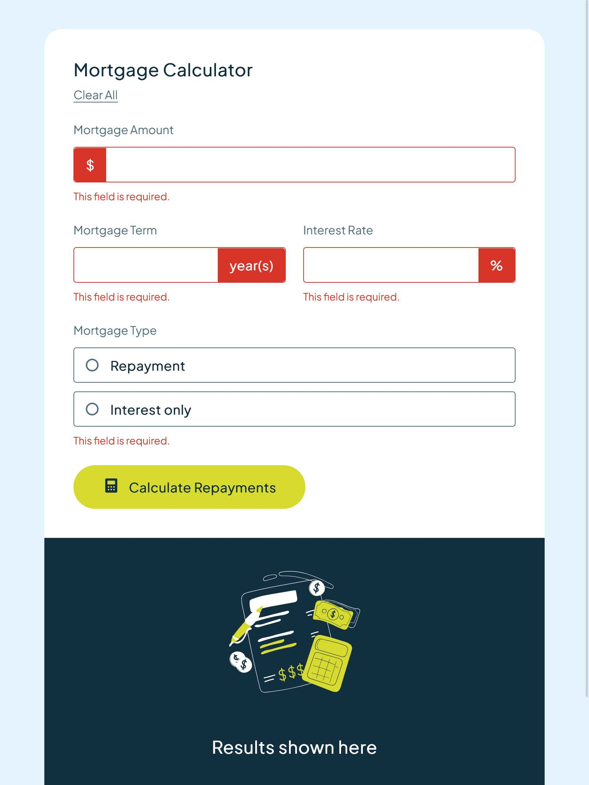
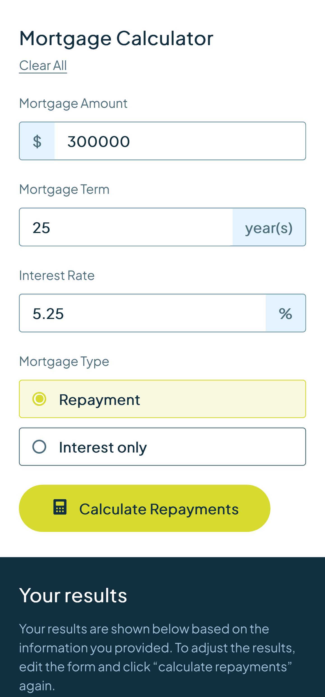
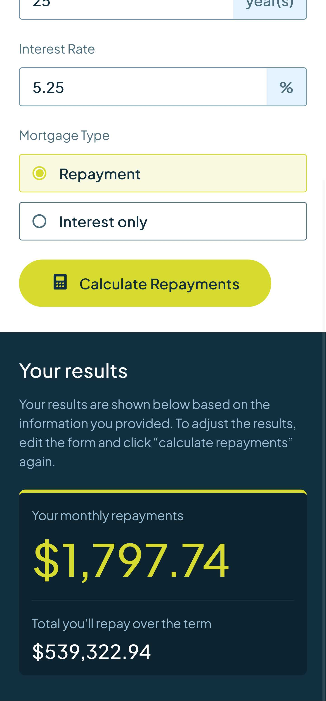

# Frontend Mentor - Mortgage repayment calculator solution

This is a solution to the [Mortgage repayment calculator challenge on Frontend Mentor](https://www.frontendmentor.io/challenges/mortgage-repayment-calculator-Galx1LXK73). Frontend Mentor challenges help you improve your coding skills by building realistic projects. 

## Table of contents

- [Overview](#overview)
  - [Screenshot](#screenshot)
  - [Links](#links)
- [My process](#my-process)
  - [Built with](#built-with)
  - [What I learned](#what-i-learned)
  - [My favourite code](#my-favourite-code)
  - [Useful resources](#useful-resources)
- [Author](#author)
- [Acknowledgments](#acknowledgments)


## Overview

### Screenshot


<div style="display: flex; gap: 0.5rem; margin-top: 1rem;">
  
  
</div>
<div style="display: flex; gap: 0.5rem; margin-top: 1rem;">
  
  
</div>


### Links

- Solution URL: [Mortgage repayment calculator Solution](https://github.com/kapil-2695/fmc-testimonial-grid-section)
- Live Site URL: [Live site - Mortgage repayment calculator](https://kapil-2695.github.io/fmc-testimonial-grid-section)


## My process
  
### Built with

- Semantic HTML5 markup
- CSS custom properties
- CSS Grid, Flexbox
- CSS `clamp()` function
- CSS media query


### What I learned

- I revised many of the javascript concepts doing this project.
- I learned methods to show error messages at input fields and hide them when user inserts values.


### My favourite code

Handling form submission event and give user appropriate feedback:
```javascript
inputFormEl.addEventListener("submit", (event) => {
    event.preventDefault()
    clearAllEmptyErrorTags()
    const formData = Object.fromEntries(new FormData(inputFormEl))

    let isEmpty = false
    for (const field in fields) {
        if (!formData[field]) {
            fields[field].classList.add("empty")
            isEmpty = isEmpty || true
        }
    }
    if (isEmpty) return

    const { emi, total } = calculateMortgage(formData)
    const options = { style: "currency", currency: "USD" }
    monthlyValueEl.textContent = `${emi.toLocaleString("en-US", options)}`
    totalValueEl.textContent = `${total.toLocaleString("en-US", options)}`

    if (formData.type === "repayment") runRepaymentSteps()
    else if (formData.type === "interest-only") runInterestOnlySteps()
    else typeEl.classList.add("empty")

    resultSectionEl.classList.remove("hide")
    resultSectionEmptyEl.classList.add("hide")
})
```


### Useful resources

- [Learn CSS - web.dev](https://web.dev/learn/css/) - This helped me with CSS code.
- [Learn Javascript - web.dev](https://web.dev/learn/javascript/) - This helped me with javascript code.


## Author

- Frontend Mentor - [@kapil-2695](https://www.frontendmentor.io/profile/kapil-2695)


## Acknowledgments

- I want to thank CSS expert Kevin Powell for creating informative content on his YouTube channel which helped me a lot in perfecting the designs. The videos also helped me handle form submissions and show error messages using css classes.
